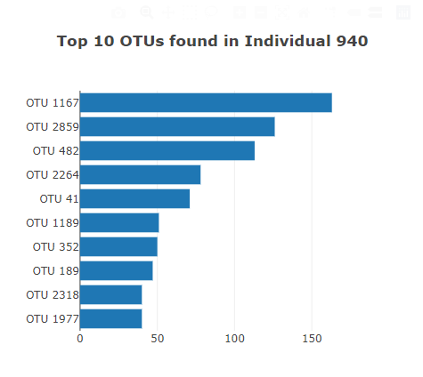
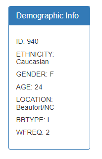
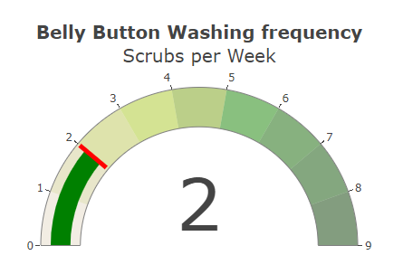
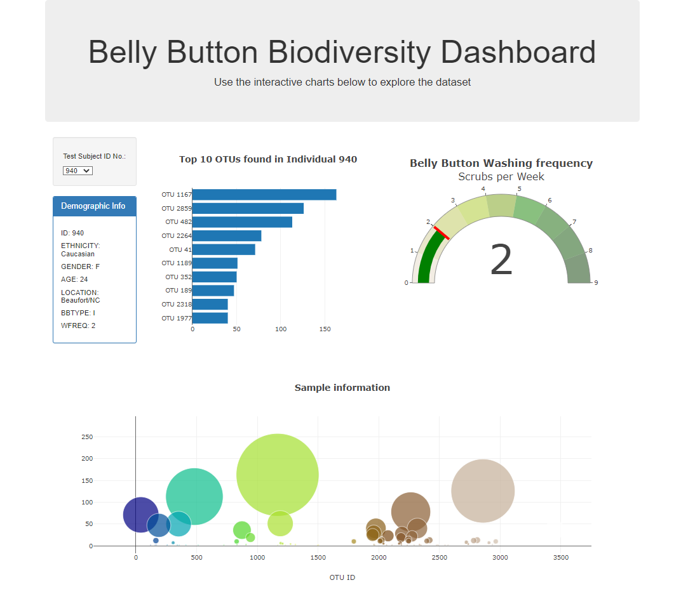

# Belly Button Challenge

This challenge is completed as requirement of Data Analytics Boot Camp at University of Toronto.

In this assignment, I have built an interactive dashboard to explore the [Belly Button Diversity Dataset](http://robdunnlab.com/projects/belly-button-biodiversity/) which catalogs the microbes that colonize human navels. The dataset reveals that a small handful of microbial species (also called operational taxonomic units, or OTUs, in the study) were present in more than 70% of people, while the rest were relatively rare.

This assignment creates the interactive dashboard by using D3 library in JavaScript. Following steps are involved in completing the dashboard:

## Setp 1: Extract Data

This step includes using D3 library to read from the [URL](https://2u-data-curriculum-team.s3.amazonaws.com/dataviz-classroom/v1.1/14-Interactive-Web-Visualizations/02-Homework/samples.json). Alternatively, the data is also stored in *data* folder in the file *samples.json*.

## Step 2: Create a Horizontal Bar Chart

This step creates a horizontal bar chart with a dropdown menu to display the top 10 OTUs found in the selected individual. The bar chart has following details:

- Use sample_values as the values for the bar chart.

- Use otu_ids as the labels for the bar chart.

- Use otu_labels as the hovertext for the chart. 

Following is an example of the bar chart displayed for individual # 940:

## Step 3: Create a Bubble Chart

This step creates a bubble chart which updates with the individual selected in the dropdown meny and displays each sample from that individual. The bubble chart has following details:

- Use otu_ids for the x values.

- Use sample_values for the y values.

- Use sample_values for the marker size.

- Use otu_ids for the marker colors.

- Use otu_labels for the text values.

Following is an example of the bubble chart displayed for individual # 940:

## Step 4: Create Demographic Information Box

This step updates the demographic information box based on the selected individual's demographic information which is extracted from the sample metadata. The box displays each key-value pair from the metadata JSON object.

Following is an example of the demographic information box displayed for individual # 940:

## Step 5: BONUS - Create a Gauge Chart

This step creates a gauge chart which displays the weekly washing frequency of the selected individual.

Following is an example of the gauge chart displayed for individual # 940:

## Step 6: Update all Plots on the Dashboard

The functions created for all the plots are added to the initialization function as well as *optionChanged* function which updates all the charts and information on the dashboard based on the individual selected from the dropdown.

Following is an example of the complete dashboard displayed for individual # 940:

